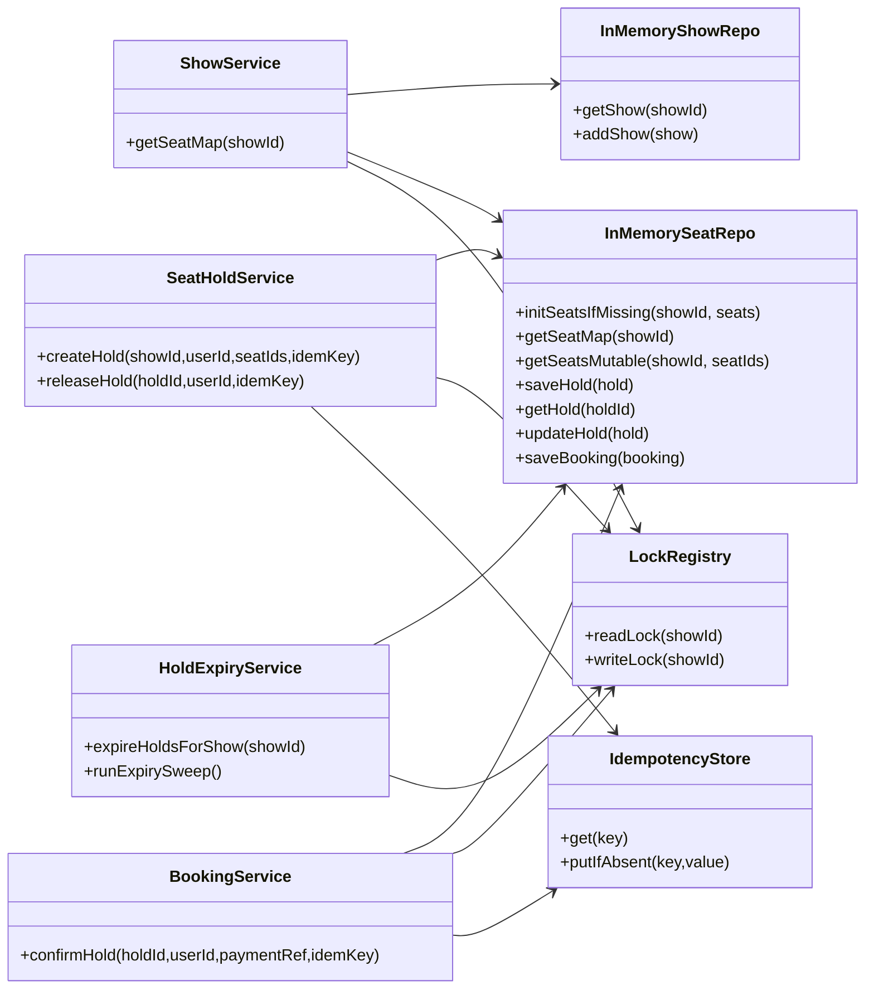

```mermaid
classDiagram
direction LR

class ShowService {
  +getSeatMap(showId)
}

class SeatHoldService {
  +createHold(showId,userId,seatIds,idemKey)
  +releaseHold(holdId,userId,idemKey)
}

class BookingService {
  +confirmHold(holdId,userId,paymentRef,idemKey)
}

class InMemoryShowRepo {
  +getShow(showId)
  +addShow(show)
}

class InMemorySeatRepo {
  +initSeatsIfMissing(showId, seats)
  +getSeatMap(showId)
  +getSeatsMutable(showId, seatIds)
  +saveHold(hold)
  +getHold(holdId)
  +updateHold(hold)
  +saveBooking(booking)
}

class LockRegistry {
  +readLock(showId)
  +writeLock(showId)
}

class IdempotencyStore {
  +get(key)
  +putIfAbsent(key,value)
}

class HoldExpiryService {
  +expireHoldsForShow(showId)
  +runExpirySweep()
}

ShowService --> InMemoryShowRepo
ShowService --> InMemorySeatRepo
ShowService --> LockRegistry

SeatHoldService --> InMemorySeatRepo
SeatHoldService --> LockRegistry
SeatHoldService --> IdempotencyStore

BookingService --> InMemorySeatRepo
BookingService --> LockRegistry
BookingService --> IdempotencyStore

HoldExpiryService --> InMemorySeatRepo
HoldExpiryService --> LockRegistry
```