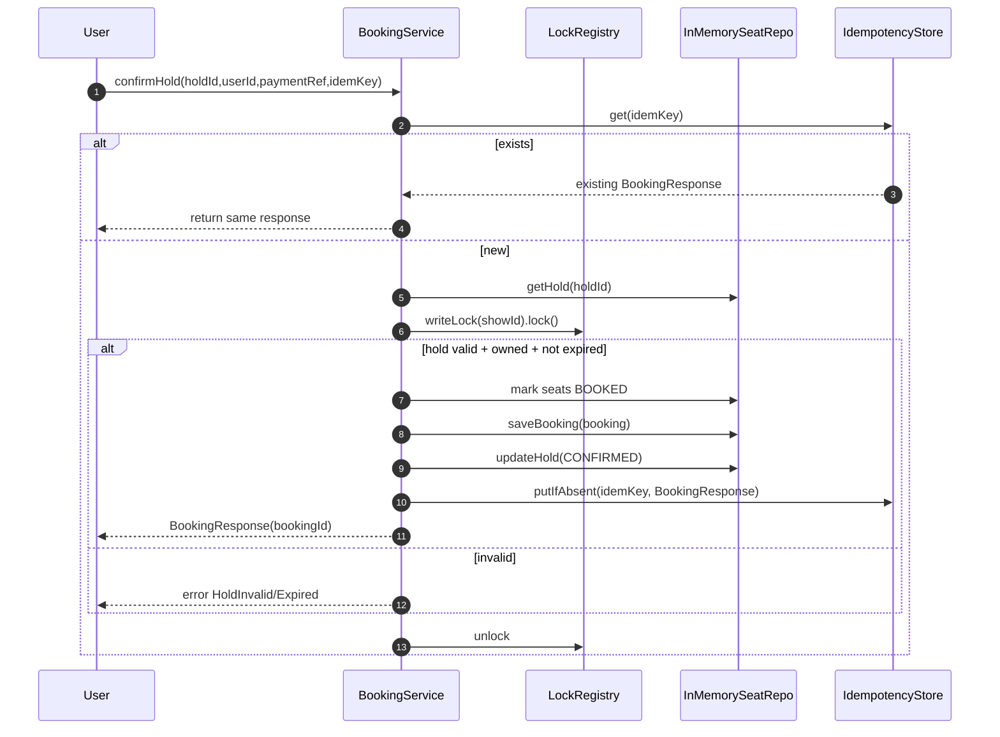

```mermaid
sequenceDiagram
autonumber
participant U as User
participant B as BookingService
participant L as LockRegistry
participant R as InMemorySeatRepo
participant I as IdempotencyStore

U->>B: confirmHold(holdId,userId,paymentRef,idemKey)
B->>I: get(idemKey)
alt exists
  I-->>B: existing BookingResponse
  B-->>U: return same response
else new
  B->>R: getHold(holdId)
  B->>L: writeLock(showId).lock()
  alt hold valid + owned + not expired
     B->>R: mark seats BOOKED
     B->>R: saveBooking(booking)
     B->>R: updateHold(CONFIRMED)
     B->>I: putIfAbsent(idemKey, BookingResponse)
     B-->>U: BookingResponse(bookingId)
  else invalid
     B-->>U: error HoldInvalid/Expired
  end
  B->>L: unlock
end
```