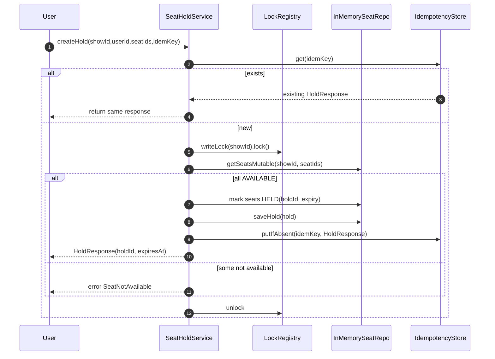

```mermaid
sequenceDiagram
autonumber
participant U as User
participant H as SeatHoldService
participant L as LockRegistry
participant R as InMemorySeatRepo
participant I as IdempotencyStore

U->>H: createHold(showId,userId,seatIds,idemKey)
H->>I: get(idemKey)
alt exists
  I-->>H: existing HoldResponse
  H-->>U: return same response
else new
  H->>L: writeLock(showId).lock()
  H->>R: getSeatsMutable(showId, seatIds)
  alt all AVAILABLE
     H->>R: mark seats HELD(holdId, expiry)
     H->>R: saveHold(hold)
     H->>I: putIfAbsent(idemKey, HoldResponse)
     H-->>U: HoldResponse(holdId, expiresAt)
  else some not available
     H-->>U: error SeatNotAvailable
  end
  H->>L: unlock
end
```