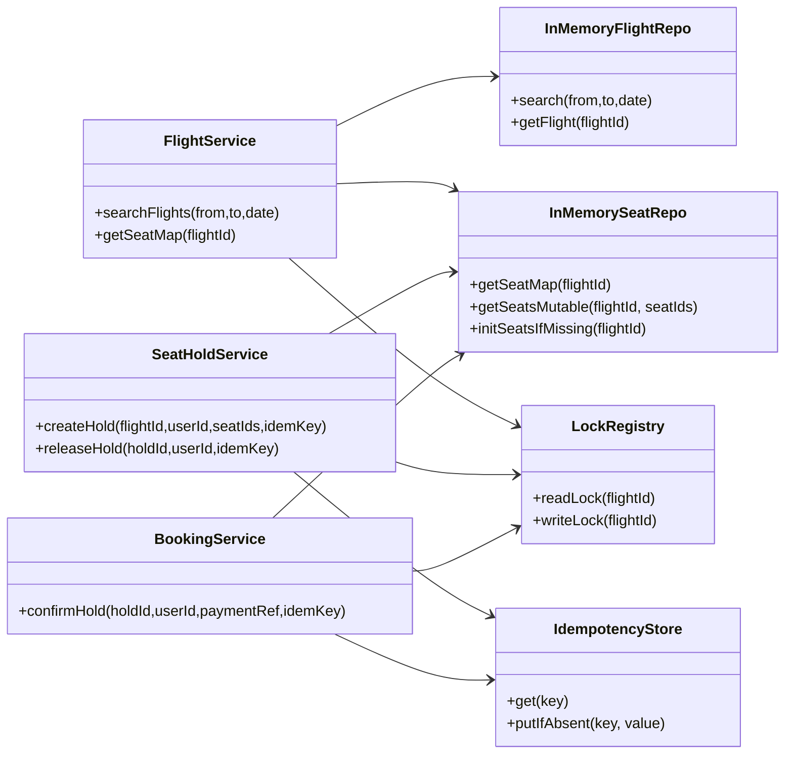

```mermaid
classDiagram
direction LR

class FlightService {
  +searchFlights(from,to,date)
  +getSeatMap(flightId)
}

class SeatHoldService {
  +createHold(flightId,userId,seatIds,idemKey)
  +releaseHold(holdId,userId,idemKey)
}

class BookingService {
  +confirmHold(holdId,userId,paymentRef,idemKey)
}

class InMemoryFlightRepo {
  +search(from,to,date)
  +getFlight(flightId)
}

class InMemorySeatRepo {
  +getSeatMap(flightId)
  +getSeatsMutable(flightId, seatIds)
  +initSeatsIfMissing(flightId)
}

class LockRegistry {
  +readLock(flightId)
  +writeLock(flightId)
}

class IdempotencyStore {
  +get(key)
  +putIfAbsent(key, value)
}

FlightService --> InMemoryFlightRepo
FlightService --> InMemorySeatRepo
FlightService --> LockRegistry

SeatHoldService --> InMemorySeatRepo
SeatHoldService --> LockRegistry
SeatHoldService --> IdempotencyStore

BookingService --> InMemorySeatRepo
BookingService --> LockRegistry
BookingService --> IdempotencyStore
```