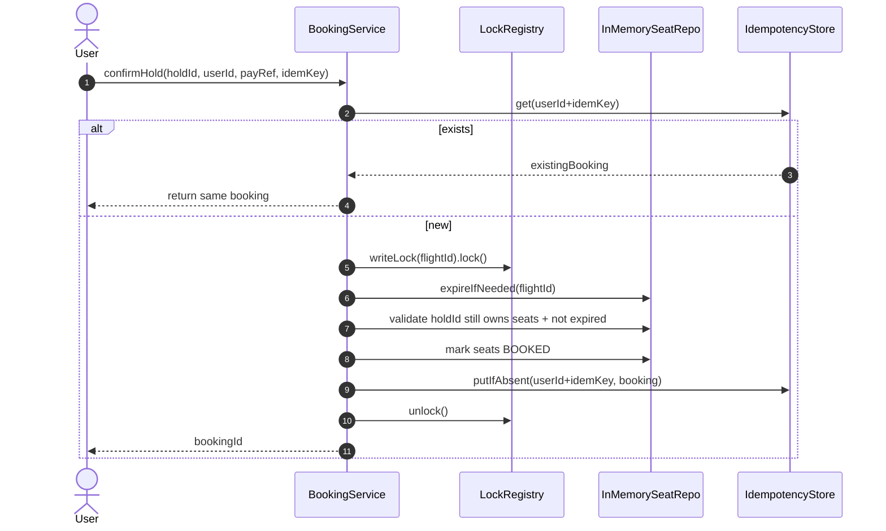

```mermaid
sequenceDiagram
autonumber
actor User
participant BookSvc as BookingService
participant Locks as LockRegistry
participant Seats as InMemorySeatRepo
participant Idem as IdempotencyStore

User->>BookSvc: confirmHold(holdId, userId, payRef, idemKey)
BookSvc->>Idem: get(userId+idemKey)
alt exists
  Idem-->>BookSvc: existingBooking
  BookSvc-->>User: return same booking
else new
  BookSvc->>Locks: writeLock(flightId).lock()
  BookSvc->>Seats: expireIfNeeded(flightId)
  BookSvc->>Seats: validate holdId still owns seats + not expired
  BookSvc->>Seats: mark seats BOOKED
  BookSvc->>Idem: putIfAbsent(userId+idemKey, booking)
  BookSvc->>Locks: unlock()
  BookSvc-->>User: bookingId
end
```