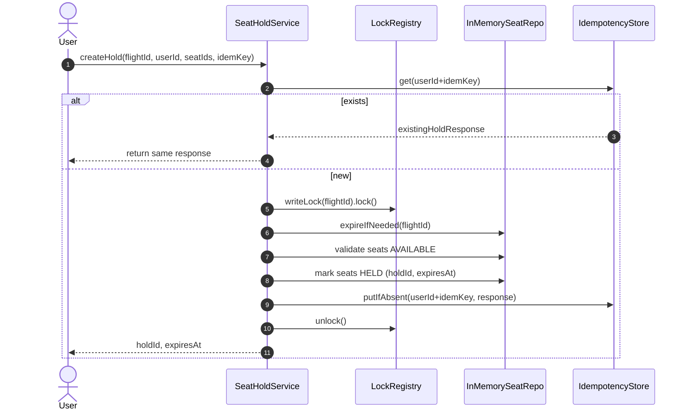

```mermaid
sequenceDiagram
autonumber
actor User
participant HoldSvc as SeatHoldService
participant Locks as LockRegistry
participant Seats as InMemorySeatRepo
participant Idem as IdempotencyStore

User->>HoldSvc: createHold(flightId, userId, seatIds, idemKey)
HoldSvc->>Idem: get(userId+idemKey)
alt exists
  Idem-->>HoldSvc: existingHoldResponse
  HoldSvc-->>User: return same response
else new
  HoldSvc->>Locks: writeLock(flightId).lock()
  HoldSvc->>Seats: expireIfNeeded(flightId)
  HoldSvc->>Seats: validate seats AVAILABLE
  HoldSvc->>Seats: mark seats HELD (holdId, expiresAt)
  HoldSvc->>Idem: putIfAbsent(userId+idemKey, response)
  HoldSvc->>Locks: unlock()
  HoldSvc-->>User: holdId, expiresAt
end
```