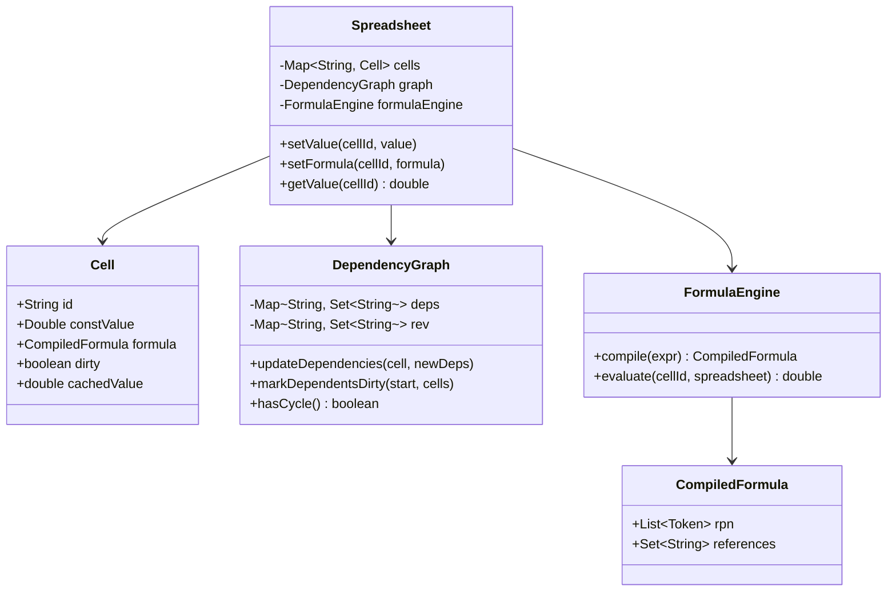

```mermaid
classDiagram
  class Spreadsheet {
    -Map~String, Cell~ cells
    -DependencyGraph graph
    -FormulaEngine formulaEngine
    +setValue(cellId, value)
    +setFormula(cellId, formula)
    +getValue(cellId) double
  }

  class Cell {
    +String id
    +Double constValue
    +CompiledFormula formula
    +boolean dirty
    +double cachedValue
  }

  class DependencyGraph {
    -Map~String, Set~String~~ deps
    -Map~String, Set~String~~ rev
    +updateDependencies(cell, newDeps)
    +markDependentsDirty(start, cells)
    +hasCycle() boolean
  }

  class FormulaEngine {
    +compile(expr) CompiledFormula
    +evaluate(cellId, spreadsheet) double
  }

  class CompiledFormula {
    +List~Token~ rpn
    +Set~String~ references
  }

  Spreadsheet --> Cell
  Spreadsheet --> DependencyGraph
  Spreadsheet --> FormulaEngine
  FormulaEngine --> CompiledFormula
```