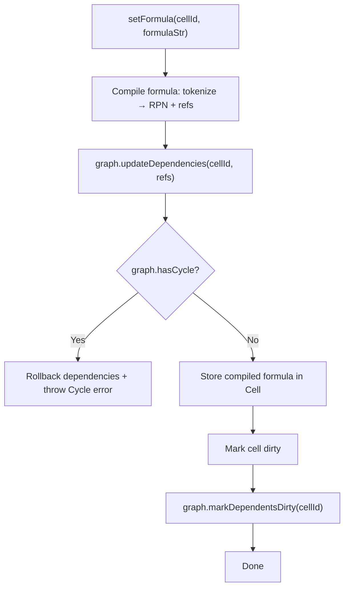

```mermaid
flowchart TD
  A["setFormula(cellId, formulaStr)"] --> B["Compile formula: tokenize → RPN + refs"]
  B --> C["graph.updateDependencies(cellId, refs)"]
  C --> D{"graph.hasCycle?"}
  D -- Yes --> E["Rollback dependencies + throw Cycle error"]
  D -- No --> F["Store compiled formula in Cell"]
  F --> G["Mark cell dirty"]
  G --> H["graph.markDependentsDirty(cellId)"]
  H --> I["Done"]
```