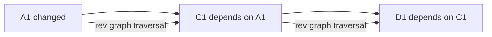

```mermaid
flowchart LR
  A1[A1 changed] --> C1[C1 depends on A1]
  C1 --> D1[D1 depends on C1]
  A1 -->|rev graph traversal| C1
  C1 -->|rev graph traversal| D1
  classDef dirty fill:#fff,stroke:#333,stroke-width:1px;
```